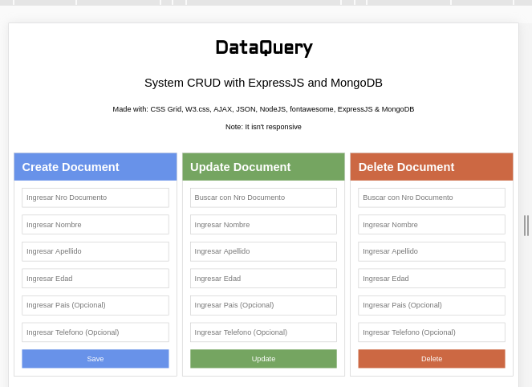

# DataQuery

### Sistema CRUD 

Sistema para administrar los datos de personas, se usa la terminacion CRUD: 

* Create 
* Read
* Update
* Delete

Requisitos 

| Detalle | Nombre |
| -- | -- |
| Motor DB | MongoDB |
| Back-end | NodeJS y Express |

